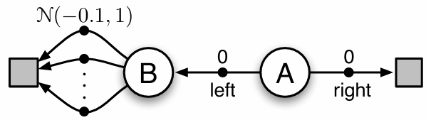

# Maximization Bias – Q-Learning vs Double Q-Learning, Expected SARSA vs Double Expected SARSA

## Project Overview

This project implements a simple two-state “biased” environment 
to illustrate **maximization bias** and compare four 
reinforcement learning algorithms:

1. **Q-Learning** (off‐policy TD)
2. **Double Q-Learning** (bias‐reduced TD)
3. **Expected SARSA** (on‐policy TD using expected value)
4. **Double Expected SARSA** (bias‐reduced version of Expected SARSA)

The environment consists of:

- **State A**: Two possible actions (`left` or `right`).  
  - `right` transitions immediately to the terminal state (no noise).  
  - `left` transitions to **State B** (no reward at this transition).
- **State B**: Ten possible actions (indexed 0–9), each
transitioning directly to the terminal state with a stochastic 
reward drawn from N(−0.1,1).

Because the rewards in State B are noisy, 
standard Q-Learning tends to overestimate their values (maximization bias) 
and thus chooses “left” in State A too often. 
Each of the four algorithms is evaluated on how frequently it chooses
the safer “left” action in State A over many episodes.

---

## Project Files

- **[maximization_bias.py](src/maximization_bias.py)**: Core implementation of the environment and learning algorithms.
  - Functions:
    - `choose_action(action_value_estimates, state)`: ε-greedy selection among available actions in the given `state`.
    - `take_action(state, action)`: Returns reward—zero if `state = A`, or a sample from N(−0.1,1) if `state = B`.
    - `q_learning(first_action_value_estimates, second_action_value_estimates=None)`:  
      - If only `first_action_value_estimates` is provided, runs a single episode of **standard Q-learning**, updating Q1(s,a).  
      - If both `first_...` and `second_...` are provided, runs a single episode of **Double Q-learning**, randomly choosing which value function to update at each step and using the other to compute the target.  
      - Returns `left_count`: the number of times “left” was chosen in State A during that episode.
    - `expected_sarsa(first_action_value_estimates, second_action_value_estimates=None)`:
      - If only `first_action_value_estimates` is provided, runs a single episode of **Expected SARSA**, updating Q1(s,a).  
      - If both `first_...` and `second_...` are provided, runs a single episode of **Double Expected SARSA**,
      - Returns `left_count`: the number of times “left” was chosen in State A during that episode.
      - Returns `left_count`: number of times “left” (action 1) is chosen in State A during that episode.
      - Computes the expected next‐state value under ε‐greedy each step.
- **[maximization_bias.ipynb](notebooks/maximization_bias.ipynb)**: Jupyter notebook for running experiments and plotting results.  
  - Contains code to run many independent episodes (1000 runs for 300 episodes for Q-learnings and 1000 runs for 1000 episodes for Expected SARSAs) and track how often “left” is chosen in **State A** under each algorithm.  
  - Generates plots of the **frequency of choosing “left”** versus the number of episodes or runs, comparing standard Q-learning to Double Q-learning and Expected Sarsa to Double Expected SARSA.

- **[requirements.txt](requirements.txt)**: Dependencies for the project

- **[README.md](README.md)**: Project documentation

---

## How it Works

### Environment Dynamics

- **State A**: Two actions  
  1. `right (0)` → transitions to **terminal**, with **reward 0**.  
  2. `left (1)` →  transitions to **State B**, with **no immediate reward**.
- **State B**: Ten actions (0–9)  
  - Any action in State B transitions to **terminal**, and returns a reward drawn from distribution N(−0.1,1).

Because each sample in State B is noisy (Gaussian noise), the standard **Q-learning** update  
$$
Q(s,a) \;\leftarrow\; Q(s,a) \;+\; \alpha\,\Bigl[r + \gamma\,\max_{a'} Q(s',a') \;-\; Q(s,a)\Bigr]
$$

tends to **overestimate** the true value of actions in State B. 
This is known as **maximization bias**.

**Double Q-learning** splits the action-value function into two independent estimates 
\(Q_1\) and \(Q_2\). At each step, it randomly picks one of the two to update, 
using the other to form the target:  

With probability 0.5, update 𝑄1 using 𝑄2 to select the next action
 $$
Q_{1}(s,a) \;\leftarrow\; Q_{1}(s,a) 
\;+\; \alpha\,\Bigl[r \;+\; \gamma\,Q_{2}\bigl(s',\,\arg\max_{a'}Q_{1}(s',a')\bigr) \;-\; Q_{1}(s,a)\Bigr]
$$

With probability 0.5, update 𝑄2 using 𝑄1 to select the next action
 $$
Q_{2}(s,a) \;\leftarrow\; Q_{2}(s,a) 
\;+\; \alpha\,\Bigl[r \;+\; \gamma\,Q_{1}\bigl(s',\,\arg\max_{a'}Q_{2}(s',a')\bigr) \;-\; Q_{2}(s,a)\Bigr]
$$

This reduces overestimation, so the agent chooses “left” more often in State A 
(avoiding noise in State B).

In case of **expected SARSA**
on‐policy TD updates use the **expected value** under an ε‐greedy policy in the next state:
1. Compute the expected next‐state action‐value:
   $$
   \text{exp\_Q} \;=\; \sum_{a'} \pi(a' \mid s')\,Q(s',a')
   $$
   where
   - For each **non‐greedy** action $a'$, $\pi(a' \mid s') = \frac{\varepsilon}{|A(s')|}$.
   - For each **greedy** action $a'$, $\pi(a' \mid s') = 1 - \varepsilon + \frac{\varepsilon}{|A(s')|}$.

2. Update $Q(s,a)$ using:
   $$
   Q(s,a) \;\leftarrow\; Q(s,a) \;+\; \alpha \Bigl[r \;+\; \gamma\,\text{exp\_Q} \;-\; Q(s,a)\Bigr]
   $$

**Double Expected SARSA** maintains two action‐value tables, Q_1 and Q_2. At each time step:

1. **Combine** values to form an ε‐greedy policy based on
   $$
   \overline{Q}(s) \;=\; Q_{1}(s) \;+\; Q_{2}(s).
   $$

2. **Flip a fair coin** (with probability 0.5) to decide which \(Q\) table to update:
   - If heads: update Q1 using Q2 to compute the expected next‐state value.
   - If tails: update Q2 using Q1 to compute the expected next‐state value.

3. Suppose we are updating Q2. Then:
   1. From state \(s\), select action \(a\) by ε‐greedy on Q(s).
   2. Observe reward \(r\) and next state \(s'\).
   3. Compute the expected next‐state action‐value using the other 
   4. table Q_1 under ε‐greedy on  Q‾(s′):
      $$
      \text{exp\_Q\_next} \;=\; \sum_{a'} \pi(a' \mid s')\,Q_{1}(s', a'),
      $$
      where pi is ε‐greedy derived from Q(s').

   4. Perform the update:
      $$
      Q_{2}(s,a) \;\leftarrow\; Q_{2}(s,a) 
      \;+\; \alpha\,\Bigl[r \;+\; \gamma\,\text{exp\_Q\_next} \;-\; Q_{2}(s,a)\Bigr].
      $$

4. If instead you were updating Q_1, swap roles of Q_1 and Q_2 in the formulas above.

By alternating updates and using the “other” table to compute expected values, **Double Expected SARSA** reduces overestimation bias compared to standard Expected SARSA.

### Hyperparameters
There is a possibility to try on your custom problem, by changing these parameters
- `states`: Mapping of state names `A`, `B`, and `terminal` to integer IDs.
- `start`: Initial state (`A`).
- `actions_A`: Two actions from State A (`right=0`, `left=1`).
- `actions_B`: Ten actions from State B (`0–9`).
- `state_action_values`: A list of three arrays holding Q-values for A (size 2), B (size 10), and terminal (size 1).  
- `transition`: Defines deterministic next-state mapping:  
  - From `A`: `[terminal, B]`  
  - From `B`: always to `terminal`  
- `exploration_probability` epsilon: 0.1
- `step_size` alpha: 0.1
- `discount` gamma: 1.0  

## Results & Visualization

The [notebook](notebooks/maximization_bias.ipynb) produces two main visualizations in a single plot:

1. **Left‐Action Frequency**  
   - For each algorithm (Q-learning vs Double Q-learning), we run many independent episodes.  
   - Count “how many times the agent picks ‘left’ in State A” in each episode.  
   - Plot the **proportion of “left” choices** (y-axis) versus the **number of episodes** (x-axis).  
   - In early episodes, both algorithms explore and may choose “right” sometimes. Over time:
     - **Q-learning**: tends to overestimate State B’s value, so it picks “right” more often (lower left‐frequency).  
     - **Double Q-learning**: shows a higher left‐frequency, preforming more cautious behavior (less biased).

So, by aggregating over many runs, we plot the asymptotic frequency of “left” for each algorithm.
This shows that **Double Q-learning** converges to a near‐optimal policy that picks “left” almost always, 
while **Q-learning** converges to a suboptimal policy with some “right” bias.

